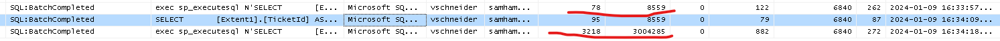

# SQL Performance Workshop

Josef Biehler

---

---

# Über mich

- Seit 2011 bei der `Samhammer AG` als Fullstack Entwickler
- http://biehler-josef.de
- http://github.com/gabbersepp
- http://dev.to/gabbersepp
- gabbersepp@googlemail.com
- Workshop: https://github.com/gabbersepp/sql-performance-workshop

---

# Index im SQL Server & Ausführungsplan

---

# Clustered Index

- Pauschal: Äquivalent für die ganze Tabelle
- Lookups schauen in Clustered Index nach
- es gibt maximal einen

---

# Non Clustered Index

- Index, der kein `Clustered Index` ist
- es kann beliebig viele geben
- mindestens eine Key Spalte, beliebige Includespalten

---

# Indices

**Ein Index erlaubt** SQL Server dass Laden der Daten ohne die ganze Tabelle scannen zu müssen. Die Key Spalte muss dazu an die `JOIN` und `WHERE` Bedingung angepasst sein.

**Ein Index erlaubt** SQL Server das Laden des kleineren Index (i.V. zu der Tabelle). Die Includespalten müssen dazu an die Spalten im `SELECT` angepasst werden.

**Indices** erzeugen Overhead. Mit Kanonen auf Spatzen schießen hilft also nicht.

---

# Vermeiden von (Dead)locks

- Non-Clustered Index kann Locks vermeiden
- Beispiel `50.sql`

---

# Lookups

- Lookup entsteht, wenn Non-Clustered Index benutzt wird, aber nicht alle Spalten enthalten sind
- Beispiel `30.sql`

<!--
Zeigen, woran an sieht, welche Felder nachgeladen werden.
Hinweis: Indexhint nur dazu da, damit der Index benutzt wird, den ich hier haben möchte
-->

---

# Lookup Nachteile

- Zu den Reads des Non-Clustered Indexzugriffs kommen noch Reads für den Zugriff auf den Clustered Index dazu
- Falls Page nicht in Cache, kommen IO Kosten, CPU (Marhsalling) dazu
- Non-Clustered Index + Lookup kann teurer sein als `Clustered Index Scan`
- **Learning:** Pauschal Indices erstellen ist keine Lösung

---

# Lookup verhindern

**Kann verhindert werden durch**:
- `Covering Index`
- `Index Join`
- Nur Spalten selektieren, die man braucht (ORM!)

---

# Statistiken

SQL Server muss den Plan anhand von Metriken erstellen. Dazu nutzt er Statistiken über Indices und Spalten. Sind diese Statistiken veraltet, haben wir ein Problem.

- Autoupdate standardmäßig aktiv
- Autoupdate wird u.A. updaten, wenn > 500 Zeilen vorhanden und **500+20%** hinzugefügt

<!--
Die 20% können dazu führen, dass Plan schlecht ist.
-->
---

# Effekt veraltete Statistiken

- Beispiel: `old-statistics.sql`

---

# Statistiken: Einfachster Fix

- Wenn Query plötzlich langsam ist, dann auf gut Glück Statistiken updaten
- `UPDATE STATISTICS <Tabelle> [Index]`

---

# Parameter Sniffing

- Optimizer "schaut" welche Werte die Parameter haben und nutzt diese für die Erzeugung des Plans
- Wichtig: Plan selber ist Parameter unabhängig
- Sniffing bei lokalen variablen ncht möglich
- lokale Variablen führen so zu "Durchschnittsplan" -> Schlechter Plan
- Beispiel: `sniffing.sql`
- Bei EF weniger ein Problem, aber bei manuellen Skripten (CURSOR!)

---

# Parameter Sniffing versagt

- initialen Parameterwerte passen nicht zur normalen Verteilung der Daten
- Beispiel: `sniffing-bad.sql`

--- 

# Parameter Sniffing - Was tun?

- `OPTION(RECOMPILE)` (EF: Interceptor)
- Neuer Plan ist **KEINE** Lösung!

<!--
Plan löschen ist keine Lösung, da nicht garantiert ist, dass der "gute" Plan zuerst erzeugt wird und auch dauerhaft im Cache bleibt.
Und offensichtlich gibt es ja Parameterkombinationen, welche für den "schlechten" Plan gut sind
-->

---

# Locks

---

# Welche Probleme treten mit Locks auf

- Locks erzeugen Blockierung
- Deadlocks

---

# Lock Escalation

- SQL entscheidet, dass ein höherwertiger Lock Ressourcensparender wäre
- Kann problematisch sein (unerwarteter Page Lock z.b.)
- Kann deaktiviert werden, aber gefährlich
- Würde ich einfach ignorieren, könnte man aber theoretisch steuern mit `TABLOCK` Hint

---

# Demo

- `locks.sql`: Beispiel 3

---

# Lock Modus

- Je nach Operation unterschiedliche Art von Lock
- Shared (S)
- Update (U)
- Exclusive (X)
- Intended Shared (IS)
- Intended Exclusive (IX)
- Shared with Intended Exclusive (SIX)
- Range

---

# Shared (S) Mode

- Für nur lesende Zugriffe
- Andere nur lesende Querys können auch zugreifen
- Modifizierende Querys nicht
- i.d.R. wird Lock nur bis Abschluss der Leseoperation gehalten
<!--
Am interessantesten, da der S Lock für die Isolation Levels wichtig ist
-->
---

# Isolation Levels

- definiert, wie sich S Locks verhalten
- Read Uncommitted (ISO)
- Read Committed (ISO)
- Repeatable Read (ISO)
- Serializable (ISO)
- Read Committed Snapshot (MS)
- Snapshot (MS)

---

# Read Uncommitted

- Dirty Reads
- Daten können gelesen werden, welche in anderer Transaktion bearbeitet aber noch nicht modifiziert wurden
- Auch per **Lock Hint** möglich: `WITH (NOLOCK)`
- Sollte nur benutzt werden, wenn hauptsächlich Leseoperationen und nur wenig Schreiboperationen erfolgen

---

# Read Committed

- S Lock beim `SELECT` notwendig
- Lock wird nur bis Ende des SELECT Statements gehalten
- Nonrepeatable Reads
  Zwischen zwei `SELECT` der gleichen Zeilen wird die Zeile modifiziert
- Phantom Reads
  Zwischen zwei `SELECT` der gleichen Range werden Zeilen gelöscht oder hinzugefügt

---

# Repeatable Read

- S Lock wird bis Ende der Transaktion gehalten
- Phantom Reads weiterhin möglich

---

# Serializable

- S Lock wird bis ans Ende der Transaktion gehalten
- Range S Lock auf gelesene Zeile sowie nächste zeile, basierend auf WHERE Statement
- wichtig: korrekte Indices!
- WHERE Statement nicht durch Index abgebildet: Range Lock auf die letzte mögliche Zeile
  --> Keine Inserts mehr möglich!
- WHERE Statement durch Index abgebildet: Range Lock auf die Zeile nach dem betroffenen Datenset
- Empfehlung: **Nicht verwenden**

---

# Read Committed Snapshot

- MSSQL-spezifisch
- Gelesenen Daten werden bis Ende der Transaktion in `tempdb`  gehalten
- Keine Shared Locks auf Daten
- Modifikation + Lesen möglich, aber `tempdb` Zugriffe

---

# Snapshot Isolation

- Arbeiten auf Kopie der Daten
- Andere Transaktion kann Daten nicht lesen, auch wenn bereits Comit erfolgt

---

# Demo

- `locks.sql` 14

---

# Deadlocks

- SQL Server wird die Transaktion rollbacken, deren Rollbackkosten geringer sind
- häufig nicht klar: Auch S Lock kann zu Deadlock führen
- Demo: `locks.sql`: 18

---

# Deadlocks vermeiden

- Ressourcen in gleicher Reihenfolge locken
- Deadlock Priority setzen
- Locks vermeiden durch Hints oder geeignete Isolation Level
- notwendige Locks reduzieren

---

# Deadlocks - Deadlock Priority

- `SET DEADLOCK_PRIORITY LOW`
<!--
Wir machen das z.B. beim Kontaktmerge, dort try/catch + retry
Deadlock Priority erzeugt deterministisches Verhalten
-->

---

# Deadlocks - Locks reduzieren

- geeigneter Index verhindert S Lock auf Clustered Index
- Demo: `locks.sql`: 19, 20

---

# Deadlocks - Analyse

- Event: Deadlock Graph
- Demo: `locks.sql`: 21

---

# Analyse blockierende Queries

- Event: Blocked Process Report
- Wichtig: Muss aktiviert werden (und wieder deaktiviert)
- Demo: `locks.sql`: 23

---

# Querydesign: Echtes Beispiel für Scancount

- Indexseek kann schlecht sein, wenn viele Executions
- Ggf kann aber Plan nicht anders gesteuert werden
- dann: Query umbauen
- `hd-scancount.sql`

---

# Wie man den SQL Optimizer zum Weinen bringt

- Funktionen oder arithmetische Operationen in `WHERE` und `JOIN`
- Demo: `optimizer-throws-up.sql`

---

# Entity Framework

- Beispielprojekt im Repo
- Stacktrace mit im Query senden
- Query modifizieren
- `SlowQueryInterceptor` spart Profiler
- Beispiel nur hingerotzt, bitte selber um geeignete Implementierung kümmern :-)