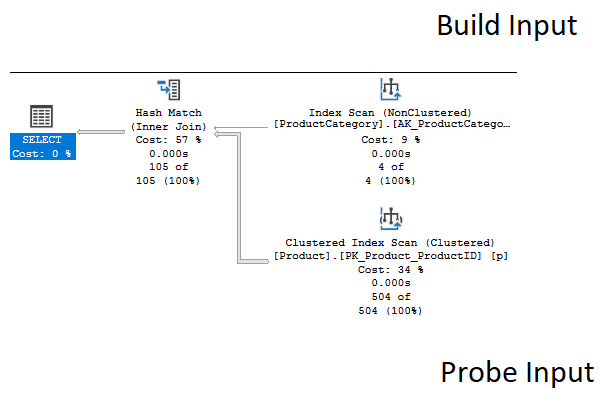

# SQL Performance Workshop

Josef Biehler

---

# Über mich

- Seit 2011 bei der Samhammer AG als Fullstack Entwickler
- biehler-josef.de
- github.com/gabbersepp
- dev.to/gabbersepp
- gabbersepp@googlemail.com
- Workshop: https://github.com/gabbersepp/sql-performance-workshop

---

# Hinweis

**Ich gehe von der Verwendung** von Entity Framework oder Ähnlichen Produkten aus, was den Einsatz von slebst geschriebenen SQL Queries reduziert und gewisse Einschränkungen mit sich bringt.

---

# Agenda

- Etwas BlaBla
- Block 1: Index & Ausführungsplan
- Block 2: Locks
- Tipps für EntityFramework

---

# Praxisrelevante Ursachen

- Schlechte Indices
- veraltete Statistiken
- schlecht gebaute Queries
- schlechte Ausführungspläne
- viel Blocking, Deadlocks
- Probleme in App (guter Query wird unnötig häufig ausgeführt)
- lang geblockte Ressourcen
- ...

---

# Wichtige Tools

- SQL Profiler
- SQL Management Studio

---

# SQL Profiler

- Demo

---

# SQL Profiler - Trace Filtern

- Abfrage der Daten per SQL möglich

```
SELECT *
FROM ::fn_trace_gettable('c:\test.trc', default)
```

---

# SQL Profiler - Wichtige Events

**Errors and Warnings**
- Blocked Process Report

**Locks**
- Deadlock Graph
- Lock: Deadlock
- Lock: Deadlock Chain
- Lock: Escalation
- Lock: Timeout

**Stored Procedures**
- RPC: Completed

**TSQL**
- SQL: BatchCompleted

---

# SQL Management Studio

- Ausführungsplan anzeigen
  - Geschätzter reicht oft auch
  - besser ist aber tatsächlicher Plan
- *Missing Index Hint* 
- Query Statistiken
- Demo

---

# Ausführungsplan

- von Links nach Rechts: Logische Richtung
- von Rechts nach Links: Physikalischer Datenfluss
- ich starte immer von Rechts
- wird im Cache gespeichert

# Ausführungsplan

- Pfeildicke
- Daten im Operator
- Predicate
- was lädt der Operator?
- Kosten

---

# Ausführungsplan - Pauschale Aussagen

- Index Scan meist schlechter als Seek
- Keylookup meistens schlecht
- Sort ohne `ORDER BY` schlecht (aber oft nicht vermeidbar)

---

# Ausführungsplan - Indexverwendung prüfen

- Je passender der Index desto weniger Reads
- Funktionen in `WHERE` und `JOIN` schlecht

---

# Ursache 1: Index im SQL Server & Ausführungsplan

---

# Clustered Index

- Pauschal: Äquivalent für die ganze Tabelle
- Lookups schauen in Clustered Index nach
- es gibt maximal einen

---

# Non Clustered Index

- Index, der kein `Clustered Index` ist
- es kann beliebig viele geben
- mindestens eine Key Spalte, beliebige Includespalten

---

# Indices

**Ein Index erlaubt** SQL Server dass Laden der Daten ohne die ganze Tabelle scannen zu müssen. Die Key Spalte muss dazu an die `JOIN` und `WHERE` Bedingung angepasst sein.

**Ein Index erlaubt** SQL Server das Laden des kleineren Index (i.V. zu der Tabelle). Die Includespalten müssen dazu an die Spalten im `SELECT` angepasst werden.

**Indices** erzeugen Overhead. Mit Kanonen auf Spatzen schießen hilft also nicht.

---

# Covering Index

- Index, welcher alle notwendigen Spalten beinhaltet
- egal ob als Key- oder Includespalte
- **Includespalte** bietet sich an, wenn die Spalte aufgrund des Datentyps keine Keyspalte sein kann
- Breitere Indices erhöhen die Wartungskosten!

---

# Index Join

- Ein Index wäre zu breit
- mehrere Indices können durch SQL Server benutzt werden
- Mittels JOIN Operator werden beide zusammengeführt
- Beispiel `60.sql`

<!--
Beispiel: Großere Kunde bei uns, Index rebuild dauert 30 minuten. 
Dann lieber neuen Index mit der spalte, viel schneller
-->

---

# Filtered Index

- Index nur für bestimmte Menge der Daten
- `CREATE NONCLUSTERED INDEX ... ON ... WHERE <predicate>`
- Aber: Wird nicht benutzt bei parameterisierten Queries
- Schwer steuerbar bei OR-Mapper
- Beispiel: `70.sql`

---

# Wann verwende ich Filtered Index

- Manipulation des Queries mit EF Interceptor

---

# Vermeiden von (Dead)locks

- Non-Clustered Index kann Locks vermeiden
- Beispiel `50.sql`

---

# Lookups

- Lookup entsteht, wenn Non-Clustered Index benutzt wird, aber nicht alle Spalten enthalten sind
- Beispiel `30.sql`

<!--
Zeigen, woran an sieht, welche Felder nachgeladen werden.
Hinweis: Indexhint nur dazu da, damit der Index benutzt wird, den ich hier haben möchte
-->

---

# Lookup Nachteile

- Zu den Reads des Non-Clustered Indexzugriffs kommen noch Reads für den Zugriff auf den Clustered Index dazu
- Falls Page nicht in Cache, kommen IO Kosten, CPU (Marhsalling) dazu
- Non-Clustered Index + Lookup kann teurer sein als `Clustered Index Scan`
- **Learning:** Pauschal Indices erstellen ist keine Lösung

---

# Lookup verhindern

**Kann verhindert werden durch**:
- `Covering Index`
- `Index Join`
- Nur Spalten selektieren, die man braucht (ORM!)

---

# Statistiken

SQL Server muss den Plan anhand von Metriken erstellen. Dazu nutzt er Statistiken über Indices und Spalten. Sind diese Statistiken veraltet, haben wir ein Problem.

- Autoupdate standardmäßig aktiv
- Autoupdate wird u.A. updaten, wenn > 500 Zeilen vorhanden und **500+20%** hinzugefügt

<!--
Die 20% können dazu führen, dass Plan schlecht ist.
-->
---

# Effekt veraltete Statistiken

- Beispiel: `old-statistics.sql`

---

# Statistiken: Einfachster Fix

- Wenn Query plötzlich langsam ist, dann auf gut Glück Statistiken updaten
- `UPDATE STATISTICS <Tabelle> [Index]`

---

# Informationen zum Ausführungsplan

- Eigenschaften des `SELECT` Operators
- CPU/Compilezeit

---

# Parameter Sniffing

- Optimizer "schaut" welche Werte die Parameter haben und nutzt diese für die Erzeugung des Plans
- Wichtig: Plan selber ist Parameter unabhängig
- Sniffing bei lokalen variablen ncht möglich
- lokale Variablen führen so zu "Durchschnittsplan" -> Schlechter Plan
- Beispiel: `sniffing.sql`
- Bei EF weniger ein Problem, aber bei manuellen Skripten (CURSOR!)

---

# Parameter Sniffing versagt

- initialen Parameterwerte passen nicht zur normalen Verteilung der Daten
- Beispiel: `sniffing-bad.sql`

--- 

# Neuen Ausführungsplan erzwingen

- `DBCC FREEPROCCACHE`
  - **Achtung:** löscht alle Pläne für alle Datenbanken! NICHT im Prod Betrieb ausführen!
- `recompile`
- `DBCC FREEPROCCACHE (handle)` löscht nur bestimmten Plan
- Handle finden: `get-plan-handle-from-query-hash.sql`

---

# Parameter Sniffing - Was tun?

- `OPTION(RECOMPILE)` (EF: Interceptor)
- Neuer Plan ist **KEINE** Lösung!

<!--
Plan löschen ist keine Lösung, da nicht garantiert ist, dass der "gute" Plan zuerst erzeugt wird und auch dauerhaft im Cache bleibt.
Und offensichtlich gibt es ja Parameterkombinationen, welche für den "schlechten" Plan gut sind
-->

---

# Auswirkung Querydesign auf Indexverwendung

- Nonsargable vs Sargable
- Nonsargable Conditions erlauben keine Indexverwendung

|Typ|Operatoren|
|----|------------|
|Sargeable|=,>,>=,<,<=, BETWEEN, manche LIKE|
|Nonsargable|<>, !=, !>, !<, NOT EXISTS, NOT IN, NOT LIKE IN, OR, manche LIKE|

---

# Non Sargeable - Weniger schlecht als man denkt

- oft kann MS SQL Server den Query selber optimieren und macht aus einer Nonsargable eine Sargable Condition

---

# (Non)Sargable Demo

- `sargable.sql`

---

# EXISTS statt COUNT(*)

- EXISTS stoppt bei erstem Ergebnis
- COUNT() muss alle zählen

---

# Ausführungsplan - JOINs prüfen

**Es gibt drei** `JOIN` Strategien:
- Hash
- Loop
- Merge

**Es geht nicht darum** eine Startegie mit Hints zu erzwingen, sondern zu wissen, welche Strategie aufgrund der Datenmenge sinnvoll ist und zu prüfen, welcher Index fehlt, weswegen die falsche Strategie angewendet wird.

**Veraltete Statistiken** können ebenfalls zur falschen `JOIN` Strategie führen.

---

# Hash Join



---

# Hash Join

**Ein Hash Join wird benutzt** für große, unsortierte Datenmengen ohne Index.

---

# Loop Join

**Wird benutzt**, wenn die Datenmengen sehr klein sind. Innere Tabelle muss jedoch auch indiziert sein

**Falsche Statistiken** können auch bei großen Datenmengen zu Loop Joins führen

---

# Merge Join

**Merge Join erfordert**, dass die Join Kriterien beider Tabellen auch sortiert in Indices vorhanden sind.

---

# JOINs Fazit

**Ich würde JOINs** eher als Hinweis auf alte Statistiken sehen. Loop Join bei großen Datenmengen wäre zum Beispiel ein Alarmsignal.

---

# JOINs Demo

- `joins.sql`

---

# DEMO 

**Wir wenden** jetzt unser Wissen an und werden mal ein paar Analyse starten. Das Ganze habe ich nicht vorbereitet, eventuell finden wir ja sogar noch was :-)

...

# Periodische Indexanalyse

- siehe `index-analysis.sql`
- geht nur auf Produktivdatenbank
- Entfernen: 
    - z.b. Indices mit hohen Kosten und geringen Verwendungen (prüfen: kritisch?)
    - oder Indices ohne Verwendung
- Aufpassen: `UNIQUE Index` kann auch nur existieren, um Eindeutigkeit sicherzustellen

---

# Periodische Analyse lang laufender Queries

- Ziel: Finden neuer, notwendiger Indices
- Profiler laufen lassen, nach gewisser Zeit Queries gruppieren, Durchschnittswerte anschauen und Konsequenzen ziehen

<!--
Demo Tracefile mit SQL öffnen
gruppieren, Anzahl Ausführungen, Reads, writes, Duration, etc
-->

---

# Demoanalyse langsamer Query

- Anders als bei der periodischen Analyse kann man sich hier mehr fokussieren
- Mal auf gut Glück einen langsamen Query suchen im  System

<!--
Periodische Analyse: Rundumschlag
Hier: Mehr im Detail arbeiten, auch Code anschauen
-->

---

# Exkurs: Woher kommt der Stacktrace?

- EF Interceptor
- Behandeln wir später noch

---

# Ursache 2: Locks

---

# Welche Probleme treten mit Locks auf

- Locks erzeugen Blockierung
- Deadlocks

---

# Locks

- Locks prüfen: `select * from sys.dm_tran_locks`
- Nachfolgend die häufigsten gelockten Ressourcen

---

# Row (RID)

- Tabelle hat keinen Clustered Index und eine Zeile wird modifiziert

<!--
Nur Info:
- *Ressourcendarstellung*: **DatabaseID:FileID:PageID:Slot(row)**
- *DatabaseID* steht in anderer Spalte
- *FileID*: Primäre Datendatei 
- *Object* EntityId mappen: **select OBJECT_NAME(1125579048)**
-->

---

# Key Lock

- Wenn Tabelle Clustered Index hat

# Page-Level-Lock

- SQL Server kann entscheiden, dass Pagelock effizienter ist als viele Key Locks

# Object

- Kann Tabelle sein oder auch was anderes

---

# Lock Escalation

- SQL entscheidet, dass ein höherwertiger Lock Ressourcensparender wäre
- Kann problematisch sein (unerwarteter Page Lock z.b.)
- Kann deaktiviert werden, aber gefährlich
- Würde ich einfach ignorieren, könnte man aber theoretisch steuern mit `TABLOCK` Hint

---

# Demo

- `locks.sql` 1,2,3

# Lock Modus

- Je nach Operation unterschiedliche Art von Lock
- Shared (S)
- Update (U)
- Exclusive (X)
- Intended Shared (IS)
- Intended Exclusive (IX)
- Shared with Intended Exclusive (SIX)
- Range

---

# Shared (S) Mode

- Für nur lesende Zugriffe
- Andere nur lesende Querys können auch zugreifen
- Modifizierende Querys nicht
- i.d.R. wird Lock nur bis Abschluss der Leseoperation gehalten

---

# Update (U) Mode

- Daten lesen mit Intention zur Modifikation
- Erst wenn Daten gelesen sind und klar ist, dass die Daten modifiziert werden, wird X Lock angefordert

# Exclusive (X) Mode

- Exklusiver Zugriff ist garantiert

---

# Intended 

- Bei X Lock auf Key wird z.B. IX Lock auf Page oder Tabelle gemacht
- Schnellere Prüfung möglich, ob andere Session X Lock auf Page oder Tabelle erhalten kann

# Range

- nur anwendbar bei Serializable Isolation Level
- verhindert einfügen neuer Zeilen innerhalb einer Range
- gelockt wird einschließlich vorheriger Key bis ausschließlich nächster Key
- Gut zu wissen: Cascade Delete erzwingt upgrade des Isolation Levels auf Serializable

---

# Demo

- `locks.sql` 4,5,6,7
- Range Lock Thematik wird später gezeigt

---

# Isolation Levels

- definiert, wie sich S Locks verhalten
- Read Uncommitted (ISO)
- Read Committed (ISO)
- Repeatable Read (ISO)
- Serializable (ISO)
- Read Committed Snapshot (MS)
- Snapshot (MS)

---

# Read Uncommitted

- Dirty Reads
- Daten können gelesen werden, welche in anderer Transaktion bearbeitet aber noch nicht modifiziert wurden
- Auch per **Lock Hint** möglich: `WITH (NOLOCK)`
- Sollte nur benutzt werden, wenn hauptsächlich Leseoperationen und nur wenig Schreiboperationen erfolgen

---

# Read Committed

- S Lock beim `SELECT` notwendig
- Lock wird nur bis Ende des SELECT Statements gehalten
- Nonrepeatable Reads
  Zwischen zwei `SELECT` der gleichen Zeilen wird die Zeile modifiziert
- Phantom Reads
  Zwischen zwei `SELECT` der gleichen Range werden Zeilen gelöscht oder hinzugefügt

---

# Repeatable Read

- S Lock wird bis Ende der Transaktion gehalten
- Phantom Reads weiterhin möglich

---

# Serializable

- S Lock wird bis ans Ende der Transaktion gehalten
- Range S Lock auf gelesene Zeile sowie nächste zeile, basierend auf WHERE Statement
- wichtig: korrekte Indices!
- WHERE Statement nicht durch Index abgebildet: Range Lock auf die letzte mögliche Zeile
  --> Keine Inserts mehr möglich!
- WHERE Statement durch Index abgebildet: Range Lock auf die Zeile nach dem betroffenen Datenset
- Empfehlung: **Nicht verwenden**

---

# Read Committed Snapshot

- MSSQL-spezifisch
- Gelesenen Daten werden bis Ende der Transaktion in `tempdb`  gehalten
- Keine Shared Locks auf Daten
- Modifikation + Lesen möglich, aber `tempdb` Zugriffe

---

# Snapshot Isolation

- Arbeiten auf Kopie der Daten
- Andere Transaktion kann Daten nicht lesen, auch wenn bereits Comit erfolgt
- Nachteil siehe Demo

---

# Demo

- `locks.sql` 8,9,10,11,12,13,14,15,16

---

# Rausfinden, was gelockt ist

- `DBCC PAGE(<db-id>, <fileid>, <page>, 3)  with tableresults`
- `select object_name(<object-id>)`
- Demo: `locks.sql`: 17

---

# Deadlocks

- SQL Server wird die Transaktion rollbacken, deren Rollbackkosten geringer sind
- häufig nicht klar: Auch S Lock kann zu Deadlock führen
- Demo: `locks.sql`: 18

---

# Deadlocks vermeiden

- Ressourcen in gleicher Reihenfolge locken
- Deadlock Priority setzen
- Locks vermeiden durch Hints oder geeignete Isolation Level
- notwendige Locks reduzieren

---

# Deadlocks - Deadlock Priority

- `SET DEADLOCK_PRIORITY LOW`
<!--
Wir machen das z.B. beim Kontaktmerge, dort try/catch + retry
Deadlock Priority erzeugt deterministisches Verhalten
-->

---

# Deadlocks - Locks reduzieren

- geeigneter Index verhindert S Lock auf Clustered Index
- Demo: `locks.sql`: 19, 20

---

# Deadlocks - Analyse

- Event: Deadlock Graph
- Demo: `locks.sql`: 21, 22

---

# Analyse blockierende Queries

- Event: Blocked Process Report
- Wichtig: Muss aktiviert werden (und wieder deaktiviert)
- Demo: `locks.sql`: 23

---

# Entity Framework

- Beispielprojekt im Repo
- Stacktrace mit im Query senden
- Query modifizieren
- Beispiel nur hingerotzt, bitte selber um geeignete Implementierung kümmern :-)

**Was machen wir noch:**
- Spalten ausschließen, um Indices besser nutzen zu können
- Deadlockpriority setzen
- ...

---

# Ende - Tipps

- Indices dokumentieren mit auslösendem Query
- Bulk Insert erzeugt untrusted FKs
- Bei Nutzung von OR-Mapper `select *` vermeiden